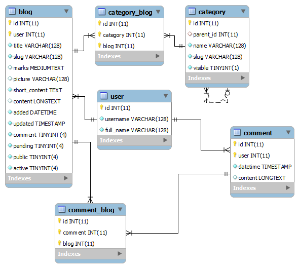

# MySql-structure-for-a-blog-with-posts-and-comments
Creating tables in a database to work with blog posts and comments for posts. Nested post categories and a link to the user table are also edited.

Build a database to work with a blog. Tables for adding and posting individual posts, categories and comments. Basic user table added.

Visit on page: https://dev-all.eu/blog/mysql-structure-for-a-blog-with-posts-and-comments
